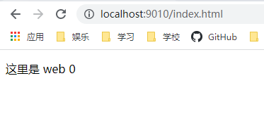

# 负载均衡

## 1、轮询（默认）

作为默认的负载均衡策略不需要过多的设置在nginx.conf中只需要配置为：

``` config
upstream web{
    server web0;
    server web1;
    server web2;
}
```

此时将会把请求逐一分配到不同的服务器中，如果服务器下线将会被自动剔除

测试中展示出现的是按照顺序访问web0,web1,web2

### 结果图




