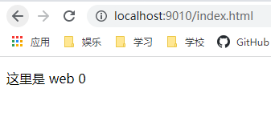
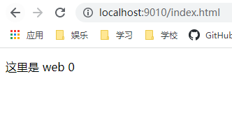

# 负载均衡

## 1、轮询（默认）

作为默认的负载均衡策略不需要过多的设置在nginx.conf中只需要配置为：

``` config
#负载均衡 1 轮询:
upstream web{
    server web0;
    server web1;
    server web2;
}
```

此时将会把请求逐一分配到不同的服务器中，如果服务器下线将会被自动剔除

测试中展示出现的是按照顺序访问web0,web1,web2

### 轮询结果图


## 2、 weight

weight设置需要配置以下配置

``` config
#负载均衡 2 weight：
upstream web{
    server web0 weight=10;
    server web1 weight=5;
    server web2 weight=5;
}
```

nginx服务将会从web0，web1,web2中根据weight权重来选择web服务

当前配置设置为web0:web1:web2 = 2:1:1 那么在访问中出现的次数也应当是 2:1:1

### weight结果图

第一次访问：



第二次访问：



第三次访问：


第四次访问：


多次访问结果确实为2:1:1